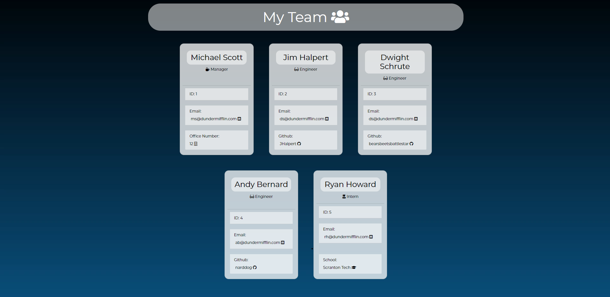
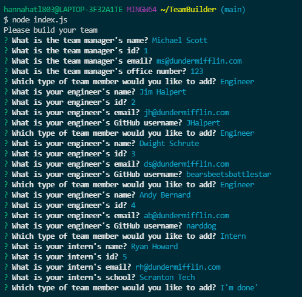

# TeamBuilder


## Description
A simple command line application using npm inquirer & jest.js to create a HTML webpage that displays each team member, their role, and their contact information.


## User Story

```
AS A manager
I WANT to generate a webpage that displays my team's basic info
SO THAT I have quick access to their emails and GitHub profiles
```

## Acceptance Criteria 

```
GIVEN a command-line application that accepts user input
WHEN I am prompted for my team members and their information
THEN an HTML file is generated that displays a nicely formatted team roster based on user input
WHEN I click on an email address in the HTML
THEN my default email program opens and populates the TO field of the email with the address
WHEN I click on the GitHub username
THEN that GitHub profile opens in a new tab
WHEN I start the application
THEN I am prompted to enter the team manager’s name, employee ID, email address, and office number
WHEN I enter the team manager’s name, employee ID, email address, and office number
THEN I am presented with a menu with the option to add an engineer or an intern or to finish building my team
WHEN I select the engineer option
THEN I am prompted to enter the engineer’s name, ID, email, and GitHub username, and I am taken back to the menu
WHEN I select the intern option
THEN I am prompted to enter the intern’s name, ID, email, and school, and I am taken back to the menu
WHEN I decide to finish building my team
THEN I exit the application, and the HTML is generated

```


## Table of Contents
1. [Screenshot](##Screenshot)
2. [Video](##Video)
3. [Installation](##Installation)
4. [Usage](##Usage)
5. [Testing](##Testing)
6. [Technologies](##Technologies)
7. [License](##License)
8. [Contributing](##Contributing)
9. [Questions](##Questions)


## Screenshot

Example of generated HTML: 



Command line example:



## Video

🎥

▶️ Watch the full length demo [here](https://drive.google.com/file/d/12LQ8W5aW2Fg3p5Lay4CU4FChb1jzC6bt/view)


## Installation

To install this application and all corresponding dependencies:
```
git clone git@github.com:hannahnmcdonald/TeamBuilder.git
cd TeamBuilder
npm install     
```

## Usage

The application will be invoked by using the following command:
```
node index.js
```
After this command is run, you will be given a serious of questions to which you will answer and press enter. After all questions are answered, your team will be generated as a HTML page in the current directory.

## Testing

To run tests, run the following commands in the correct directory of your command line
```
npm test
```


## Technologies

* Node.js
* npm inquirer
* npm fs
* jest.js
* Bootstrap


## License

This repository is under the MIT License.


## Contributing

1. Fork the repo from Github
2. Clone the repo locally
3. Commit your changes
4. Push to your branch
5. Open a Pull request for review

## Questions?

Contact me at hannahcodes@protonmail.com 📫

